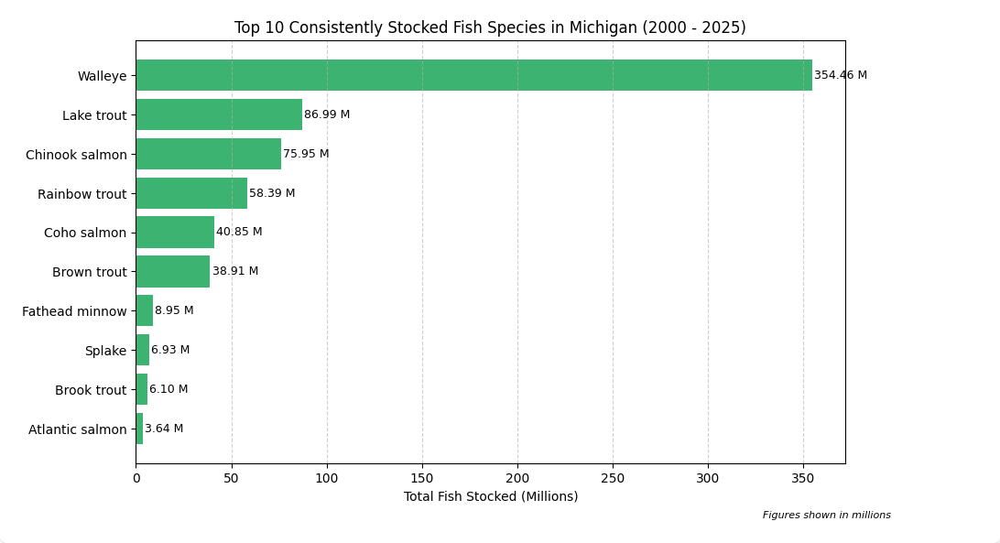
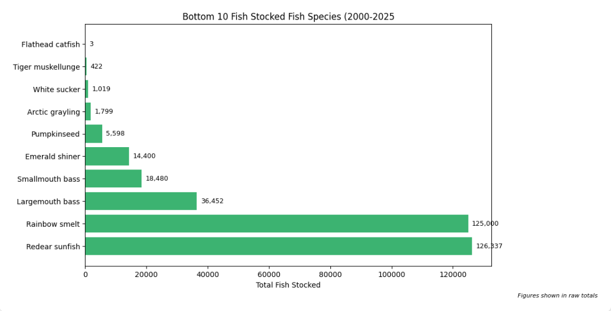
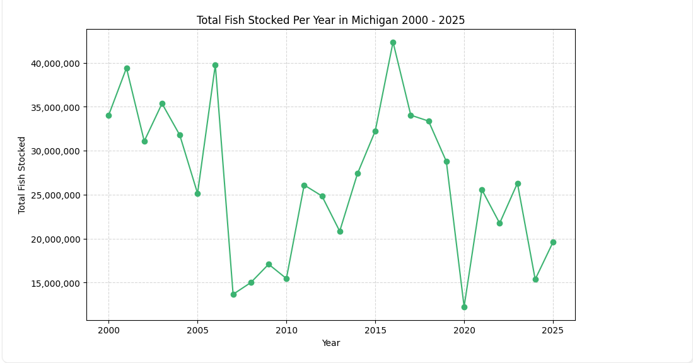
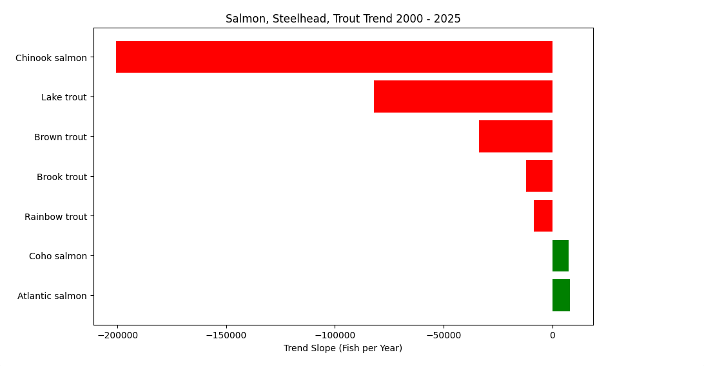
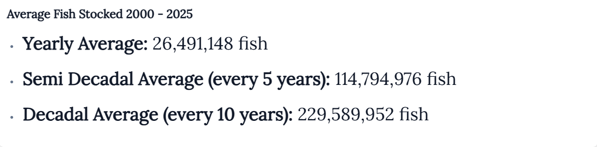
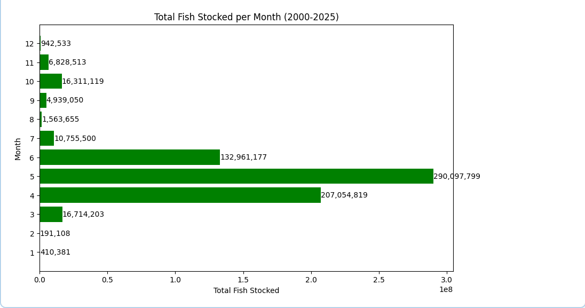

# Michigan Fish Stocking Trends (2000-2005)

---

This project analyzes historical fish stocking data from the Michigan Department of Natural Resources (MDNR) between 2000 and 2025. The aim is to uncover long term patterns in the stocking practices across water bodies, identify ecological or management shifts, and explore changes in species level stocking over time.

---

## Objectives
- What is the top 10 and bottom 10 fish species stocked from 2000 to 2025?
- How has fish stocking changed over the years?
- What is the average amount of fish stocked yearly, Semi decadelly, and decadelly?
- What fish species has seen an increase in stocking efforts and which have seen a decline?
  - Has salmon, trout, and steelhead stocking efforts decreased or increased since 2000?
- What time of year (month) does stocking usually take place? How many times a year? 
- Which counties see the most effort in stocking? Which ones see significantly less efforts? 
- What water bodies have the lowest number of stocking efforts? What water bodies have the highest stocking efforts?

---

## Tools Used

- **Python**
  - `pandas` for data manipulation
  - `matplotlib` / `PowerBI` for visualization
- **Marimo** for interactive data exploration
- **CSV File** as raw data input

---

## Data Source

- Source: [MDNR Fish Stocking Database](https://www.dnr.state.mi.us/fishstock/)
- Format: CSV
- Fields include: Year, Species, Number Stocked, Waterbody, County, Size, Date

---

## Sample Questions Explored

- what is the top 10 and bottom 10 fish species stocked from 2000 to 2025?
- Has salmon, trout, and steelhead stocking efforts decreased or increased since 2000?
- Which counties see the most effort in stocking? Which ones see significantly less efforts?
- What water bodies have the lowest number of stocking efforts? What water bodies have the highest stocking efforts?

---

## Sample Insights 
- Top 10 Fish Species Stocked:

- Bottom 10 Fish Species Stocked:

- Total Fish Stocked Per Year:

- Salmon, Steelhead, and Trout Trend:

- Total Yearly Averages of Stocked Fish:

- Total of Fish Stocked per Month

---

## License

This project is for educational and research purposes only. Data © Michigan Department of Natural Resources.